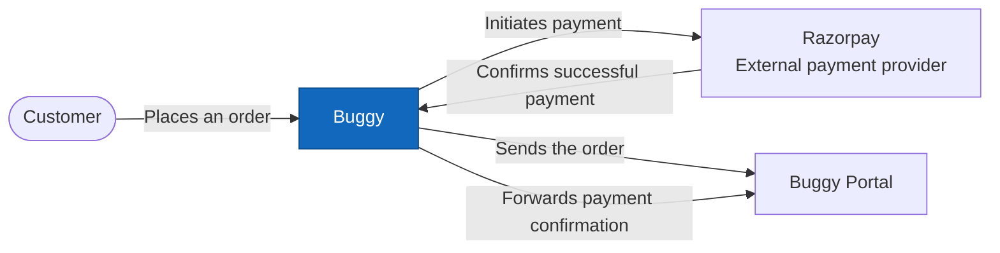
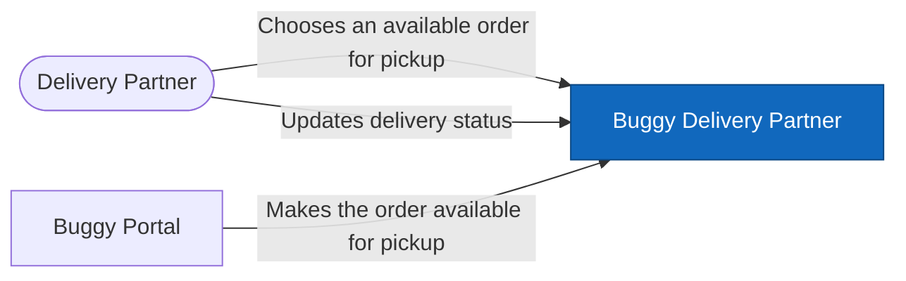
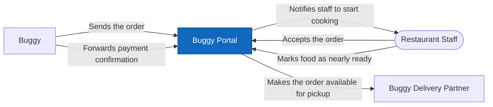

# Buggy frontends

## Buggy

```mermaid
flowchart LR
    customer([Customer]) -->|Places an order| buggy[Buggy]
    buggy -->|Initiates payment| razorpay["Razorpay<br/>External payment provider"]
    razorpay -->|Confirms successful payment| buggy
    buggy -->|Sends the order| portal[Buggy Portal]
    buggy -->|Forwards payment confirmation| portal
    style buggy fill:#1168bd,stroke:#0b4884,color:#fff
```

## Buggy Delivery Partner

```mermaid
flowchart LR
    partner([Delivery Partner]) -->|Chooses an available order for pickup| delivery[Buggy Delivery Partner]
    partner -->|Updates delivery status| delivery
    portal[Buggy Portal] -->|Makes the order available for pickup| delivery
    style delivery fill:#1168bd,stroke:#0b4884,color:#fff
```

## Buggy Portal

```mermaid
flowchart LR
    buggy[Buggy] -->|Sends the order| portal[Buggy Portal]
    buggy -->|Forwards payment confirmation| portal
    staff([Restaurant Staff]) -->|Accepts the order| portal
    staff -->|Marks food as nearly ready| portal
    portal -->|Notifies staff to start cooking| staff
    portal -->|Makes the order available for pickup| delivery[Buggy Delivery Partner]
    style portal fill:#1168bd,stroke:#0b4884,color:#fff
```
