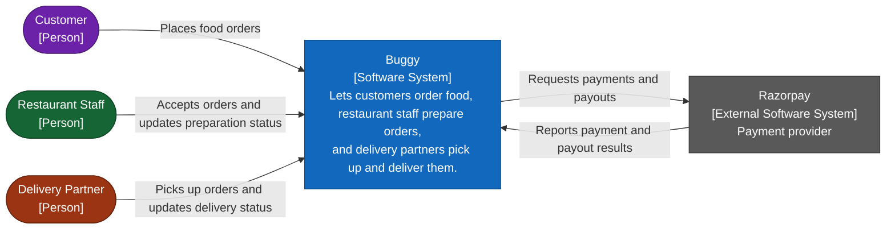

# Buggy Food Delivery — C4 System Context

**Purpose.** Show who uses Buggy and which external system it depends on. The single Buggy box represents the entire food delivery platform.

```mermaid
flowchart LR
    customer(["Customer<br/>[Person]"])
    restaurant(["Restaurant Staff<br/>[Person]"])
    partner(["Delivery Partner<br/>[Person]"])
    buggy["Buggy<br/>[Software System]<br/>Lets customers order food, restaurant staff prepare orders,<br/>and delivery partners pick up and deliver them."]
    razorpay["Razorpay<br/>[External Software System]<br/>Payment provider"]

    customer -->|Places food orders| buggy
    restaurant -->|Accepts orders and updates preparation status| buggy
    partner -->|Picks up orders and updates delivery status| buggy
    buggy -->|Requests payments and payouts| razorpay
    razorpay -->|Reports payment and payout results| buggy

    style customer fill:#6b21a8,stroke:#4c1d75,color:#fff
    style restaurant fill:#166534,stroke:#0e4423,color:#fff
    style partner fill:#9a3412,stroke:#65220b,color:#fff
    style buggy fill:#1168bd,stroke:#0b4884,color:#fff
    style razorpay fill:#595959,stroke:#383838,color:#fff
```
